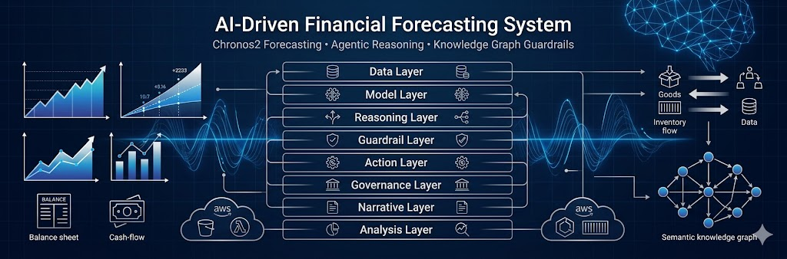

<p align="center">
  
</p>

# **AI‑Driven Financial Forecasting System**  
*A modular, cloud‑portable financial forecasting engine built on synthetic enterprise data, Chronos2 time‑series modeling, agentic reasoning, and a semantic knowledge graph enforcing financial Integrity, Auditability, Transparency, and GAAP/SOX Governance.*

---


---

## 🚀 **Project Overview**
This project demonstrates how to design and implement a **production‑grade financial forecasting platform** from the ground up. It combines:

- A **synthetic enterprise data generator** (GL, inventory, ABC costing, supply chain)  
- A **Chronos2‑based forecasting service** for multi‑horizon probabilistic predictions  
- An **agentic workflow** that plans, proposes, and validates forecasts  
- A **semantic knowledge graph** enforcing deterministic GAAP reporting requirements  
- A **cloud‑portable storage abstraction** supporting both local (Colab) and AWS (S3) execution  
- A roadmap for **AWS deployment** via Lambda, ECS, Terraform, and S3 model registry  
- A full **8‑Layer Enterprise Architecture** that mirrors real-world FP&A and ML governance systems  

The system is engineered to showcase **ML engineering**, **financial domain expertise**, and **cloud architecture** in a single cohesive project.

---

# 📐 **8‑Layer Financial Forecasting Architecture**

This project is structured around an enterprise‑grade, extensible 8‑layer architecture:

---

## **1. Data Layer**  
Handles all synthetic enterprise data generation:

- Product master  
- Vendor master  
- ABC costing  
- Inventory movements  
- General ledger entries  
- Accruals, deferrals, retained earnings  
- Supply chain hooks  

This layer ensures the system has **realistic, GAAP‑aligned** data to train on.

---

## **2. Model Layer**  
Implements the **Chronos2 Forecasting Service**, including:

- Multi‑horizon probabilistic forecasting  
- Feature extraction  
- Backtesting  
- Model evaluation  
- Exportable forecast artifacts  
- Cloud‑portable model registry  

Chronos2 is the **primary and only** forecasting model.

---

## **3. Reasoning Layer**  
Implements the **agentic workflow**:

- Planner → determines forecasting strategy  
- Proposer → generates candidate forecasts  
- Constraint Validator → checks outputs against the knowledge graph  

This layer ensures forecasts are **strategic**, not just statistical.

---

## **4. Guardrail Layer**  
Powered by the **Semantic Knowledge Graph**, enforcing:

- Cash flow depletion prevention  
- Balance sheet integrity  
- Inventory balance rules  
- Revenue recognition  
- COGS relationships  
- Multi‑entity dependencies  
- Constraint propagation  

This layer prevents financially invalid outputs.

---

## **5. Action Layer**  
Executes the final forecasting workflow:

- Runs Chronos2 predictions  
- Applies GL patching  
- Generates balance sheet and cash flow statements  
- Stores results via LocalStorage or S3Storage  

This is the operational “do the work” layer.

---

## **6. Governance Layer**  
Implements enterprise‑grade controls:

- Logging  
- Audit trails  
- Model versioning  
- Data lineage  
- Policy enforcement  

This layer ensures the system is **safe, traceable, and compliant**.

---

## **7. Narrative Layer**  
Uses an LLM to generate:

- CFO‑ready talking points  
- Forecast explanations  
- Risk commentary  
- Scenario narratives  
- Margin drivers and business insights  

This layer transforms raw forecasts into **executive‑ready communication**.

---

## **8. Analysis Layer**  
Performs deep financial analytics:

- Margin stability  
- Volume vs. price decomposition  
- COGS structure analysis
- Product cost containment  
- Working capital dynamics  
- Sensitivity analysis  

This layer provides **diagnostics**, not just predictions.

---

# 🧱 **High‑Level System Architecture**

The platform consists of five major subsystems:

- **Synthetic Data Engine**  
- **Chronos2 Forecasting Service**  
- **Agentic Workflow**  
- **Semantic Knowledge Graph**  
- **Storage Abstraction Layer**  

---

# 📁 **Repository Structure**

```
ai-financial-forecasting/
│
├── data_gen/
│   │
│   ├── master_data/
│   │   ├── customer.py
│   │   ├── product.py
│   │   └── vendors.py
│   │
│   ├── contracts/
│   │   ├── customer_contracts.py
│   │   └── customer_allocation.py
│   │
│   ├── costing/
│   │   └── abc_costing.py
│   │
│   ├── inventory/
│   │   └── inventory.py
│   │
│   ├── ledger/
│   │   └── general_ledger.py
│   │
│   ├── financials/
│   │   ├── income_statement.py
│   │   ├── balance_sheet.py
│   │   ├── cash_flow.py
│   │   ├── budget_income_statement.py
│   │   └── opening_balance_sheet.py
│   │
│   ├── macro/
│   │   └── macro.py
│   │
│   ├── kg/
│   │   └── knowledge_graph.py
│   │
│   └── orchestration/
│       └── data_generator.py
│
└── (repo root files: README.md, .gitignore, etc.)
```

---

# 🧬 **Key Features**

## **1. Synthetic Financial Data Engine**
Generates realistic enterprise datasets:

- Product master  
- Vendor master  
- ABC costing  
- Inventory movements  
- General ledger entries  
- Accruals, deferred revenue, retained earnings  
- Multi‑product revenue streams  
- Supply chain forecasting hooks  

---

## **2. General Ledger Patching + Financial Statements**
A full GL patching workflow ensures financial integrity:

- GL patching engine  
- Balance sheet generator  
- Cash flow statement generator  
- Working capital logic  
- Accruals and deferrals  
- Multi‑product revenue segmentation  

---

## **3. Chronos2 Forecasting Service**
A dedicated forecasting subsystem built around Chronos2:

- Probabilistic forecasting  
- Multi‑horizon predictions  
- Automatic feature extraction  
- Backtesting and evaluation  
- Exportable forecast artifacts  
- Cloud‑portable model registry  

---

## **4. Agentic Workflow**
A three‑stage agent pipeline:

1. **Planner**  
2. **Proposer**  
3. **Constraint Validator**  

Ensures forecasts are **financially coherent**, not just statistically plausible.

---

## **5. Semantic Knowledge Graph**
Encodes deterministic financial logic:

- Cash flow constraints  
- Balance sheet integrity  
- Inventory balance rules  
- Revenue recognition  
- COGS relationships  
- Multi‑entity relationships  
- Constraint propagation  

---

## **6. Cloud‑Portable Storage Abstraction**
Supports two execution modes:

- **Local mode (Colab)** — `LocalStorage`  
- **AWS mode** — `S3Storage`  

The forecasting logic stays identical; only the storage backend changes.

---

# 🛠️ **Tech Stack**

- **Python 3.10+**  
- **Chronos2**  
- **Pandas / NumPy / PyTorch**  
- **NetworkX**  
- **AWS S3 / Lambda / ECS**  
- **Terraform**  
- **Docker**  

---

# 📊 **Example Workflow**

1. Generate synthetic enterprise datasets  
2. Patch GL and generate financial statements  
3. Train Chronos2 forecasting models  
4. Run agentic workflow to produce validated forecasts  
5. Store results locally or in S3  
6. Deploy forecasting service to AWS  

---

# 🧭 **AWS Deployment Roadmap**

- S3‑based model registry  
- Lambda packaging for inference  
- ECS containerization for batch forecasting  
- CloudWatch logging  
- Terraform infrastructure provisioning  
- API Gateway endpoints for real‑time forecasts  

---

# 📈 **Future Enhancements**

- Multi‑entity forecasting  
- Anomaly detection for ledger entries  
- Reinforcement learning for inventory optimization  
- Streamlit dashboard  
- REST API for real‑time forecasting  

---

# 📜 **License**
MIT License — free to use, modify, and distribute.

---

# 🤝 **Contributions**
Pull requests are welcome.  
For major changes, please open an issue first to discuss the proposal.

---
